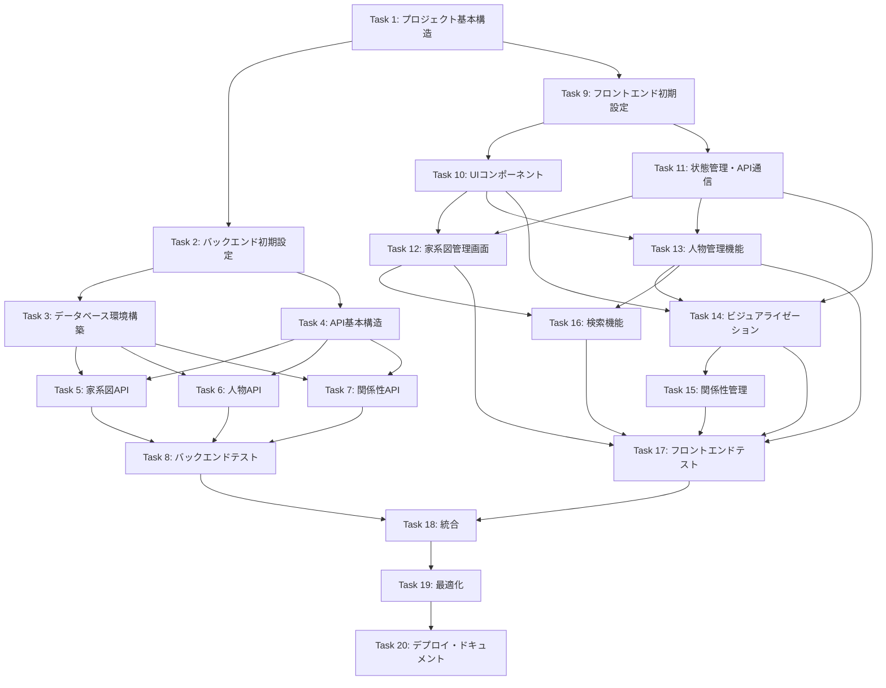

# 家系図作成WEBアプリケーション タスク分割

## 1. プロジェクト初期設定

### Task 1: プロジェクト基本構造の作成
- **概要**: モノレポ構造の初期設定
- **詳細**:
  - ルートディレクトリ構成
  - frontend/backendディレクトリ作成
  - 共通設定ファイル（.gitignore, .editorconfig等）
- **依存**: なし
- **見積時間**: 1時間
- **担当**: エンジニア1

## 2. バックエンド開発

### Task 2: バックエンド初期設定
- **概要**: Express.js + TypeScript環境構築
- **詳細**:
  - package.json作成
  - TypeScript設定
  - Express基本設定
  - 開発用スクリプト設定
- **依存**: Task 1
- **見積時間**: 2時間
- **担当**: エンジニア1

### Task 3: データベース環境構築
- **概要**: SQLite + Prisma設定
- **詳細**:
  - Prisma初期化
  - スキーマ定義（schema.prisma）
  - マイグレーション実行
  - シードデータ作成
- **依存**: Task 2
- **見積時間**: 2時間
- **担当**: エンジニア1

### Task 4: API基本構造実装
- **概要**: APIの基本構造とミドルウェア設定
- **詳細**:
  - ルーティング構造
  - エラーハンドリングミドルウェア
  - バリデーションミドルウェア
  - CORS設定
- **依存**: Task 2
- **見積時間**: 2時間
- **担当**: エンジニア2

### Task 5: 家系図APIエンドポイント実装
- **概要**: FamilyTree CRUDエンドポイント
- **詳細**:
  - GET /api/family-trees
  - POST /api/family-trees
  - GET /api/family-trees/:id
  - PUT /api/family-trees/:id
  - DELETE /api/family-trees/:id
- **依存**: Task 3, Task 4
- **見積時間**: 3時間
- **担当**: エンジニア1

### Task 6: 人物APIエンドポイント実装
- **概要**: Person CRUDエンドポイント
- **詳細**:
  - GET /api/family-trees/:treeId/persons
  - POST /api/family-trees/:treeId/persons
  - GET /api/persons/:id
  - PUT /api/persons/:id
  - DELETE /api/persons/:id
- **依存**: Task 3, Task 4
- **見積時間**: 3時間
- **担当**: エンジニア2

### Task 7: 関係性APIエンドポイント実装
- **概要**: Relationship CRUDエンドポイント
- **詳細**:
  - GET /api/family-trees/:treeId/relationships
  - POST /api/family-trees/:treeId/relationships
  - PUT /api/relationships/:id
  - DELETE /api/relationships/:id
- **依存**: Task 3, Task 4
- **見積時間**: 3時間
- **担当**: エンジニア3

### Task 8: バックエンド単体テスト実装
- **概要**: Jest + Supertestによるテスト
- **詳細**:
  - テスト環境構築
  - コントローラーテスト
  - サービステスト
  - バリデーションテスト
- **依存**: Task 5, Task 6, Task 7
- **見積時間**: 4時間
- **担当**: エンジニア1

## 3. フロントエンド開発

### Task 9: フロントエンド初期設定
- **概要**: React + Vite + TypeScript環境構築
- **詳細**:
  - Viteプロジェクト作成
  - TypeScript設定
  - Tailwind CSS設定
  - 基本的なディレクトリ構造
- **依存**: Task 1
- **見積時間**: 2時間
- **担当**: エンジニア2

### Task 10: UIコンポーネント基盤構築
- **概要**: 基本的なUIコンポーネントライブラリ
- **詳細**:
  - ボタン、フォーム要素
  - モーダル、ポップアップ
  - レイアウトコンポーネント
  - テーマ設定（ダーク/ライトモード）
- **依存**: Task 9
- **見積時間**: 3時間
- **担当**: エンジニア3

### Task 11: 状態管理とAPI通信層実装
- **概要**: Zustand + Axios設定
- **詳細**:
  - Zustandストア設定
  - API通信サービス層
  - エラーハンドリング
  - ローディング状態管理
- **依存**: Task 9
- **見積時間**: 3時間
- **担当**: エンジニア2

### Task 12: 家系図管理画面実装
- **概要**: 家系図一覧・作成・編集画面
- **詳細**:
  - 家系図一覧表示
  - 新規作成フォーム
  - 編集・削除機能
  - ルーティング設定
- **依存**: Task 10, Task 11
- **見積時間**: 4時間
- **担当**: エンジニア2

### Task 13: 人物管理機能実装
- **概要**: 人物の追加・編集・削除機能
- **詳細**:
  - 人物情報フォーム
  - 人物カードコンポーネント
  - 人物詳細モーダル
  - 写真アップロード対応
- **依存**: Task 10, Task 11
- **見積時間**: 4時間
- **担当**: エンジニア3

### Task 14: 家系図ビジュアライゼーション実装
- **概要**: React Flowによる家系図表示
- **詳細**:
  - React Flow統合
  - ノード（人物）カスタマイズ
  - エッジ（関係性）表示
  - ズーム・パン機能
  - レイアウトアルゴリズム
- **依存**: Task 10, Task 11, Task 13
- **見積時間**: 6時間
- **担当**: エンジニア1

### Task 15: 関係性管理機能実装
- **概要**: 人物間の関係性定義UI
- **詳細**:
  - ドラッグ&ドロップで関係性作成
  - 関係性タイプ選択
  - 関係性の編集・削除
  - 視覚的フィードバック
- **依存**: Task 14
- **見積時間**: 4時間
- **担当**: エンジニア1

### Task 16: 検索・フィルタリング機能実装
- **概要**: 人物検索とフィルタリング
- **詳細**:
  - 検索バー実装
  - フィルタリングオプション
  - 検索結果表示
  - ハイライト機能
- **依存**: Task 12, Task 13
- **見積時間**: 3時間
- **担当**: エンジニア3

### Task 17: フロントエンド単体テスト実装
- **概要**: Vitest + React Testing Library
- **詳細**:
  - テスト環境構築
  - コンポーネントテスト
  - カスタムフックテスト
  - ストアテスト
- **依存**: Task 12, Task 13, Task 14, Task 15, Task 16
- **見積時間**: 4時間
- **担当**: エンジニア2

## 4. 統合・最終調整

### Task 18: フロントエンド・バックエンド統合
- **概要**: API接続と動作確認
- **詳細**:
  - API通信の実装確認
  - エラーハンドリング確認
  - データフローの検証
- **依存**: Task 8, Task 17
- **見積時間**: 3時間
- **担当**: エンジニア1

### Task 19: パフォーマンス最適化
- **概要**: アプリケーション全体の最適化
- **詳細**:
  - バンドルサイズ最適化
  - レンダリング最適化
  - API通信最適化
  - キャッシュ戦略実装
- **依存**: Task 18
- **見積時間**: 3時間
- **担当**: エンジニア2

### Task 20: デプロイ設定・ドキュメント作成
- **概要**: デプロイ準備と文書化
- **詳細**:
  - README作成
  - デプロイスクリプト
  - 環境変数設定
  - 使用方法ドキュメント
- **依存**: Task 19
- **見積時間**: 2時間
- **担当**: エンジニア3

## 依存関係マトリクス

## 並列実行可能なタスクグループ

1. **初期並列グループ**:
   - Task 2（バックエンド初期設定）
   - Task 9（フロントエンド初期設定）

2. **バックエンド並列グループ**:
   - Task 5（家系図API）
   - Task 6（人物API）
   - Task 7（関係性API）

3. **フロントエンド並列グループ**:
   - Task 12（家系図管理画面）
   - Task 13（人物管理機能）

## 総見積時間
- 合計: 約65時間
- 並列実行を考慮した実時間: 約30-35時間（3人のエンジニアで分担）