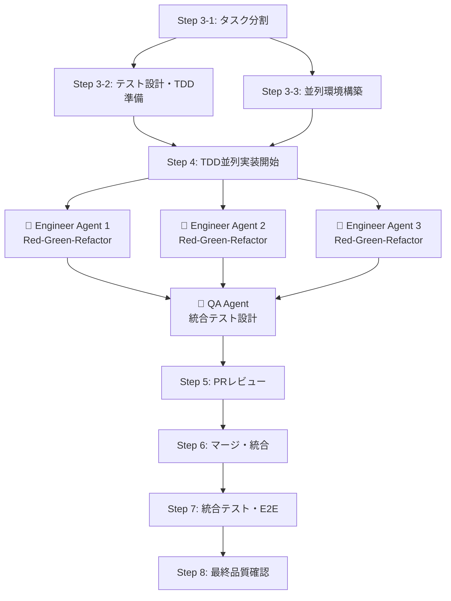
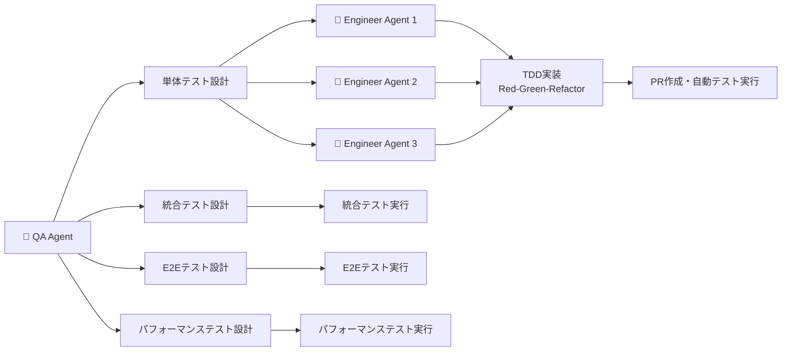

# 📖 AI駆動マルチエージェント開発フレームワーク 使用ガイド

**最小構成でのシンプル導入ガイド**

---

## 🚀 クイックスタート

### **パターン1: ゼロから新規プロジェクト開始**

```bash
# 1. プロジェクト作成
mkdir my-new-project && cd my-new-project

# 2. AIフレームワーク追加
git remote add ai-framework-remote <this-repo-url>
git subtree add --prefix ai-framework ai-framework-remote main --squash

# 3. 最小構成セットアップ
mkdir -p .ai/{instructions,logs}
mkdir -p .claude
cp ai-framework/.claude/settings.json .claude/settings.json
echo ".ai/logs/" >> .gitignore
echo ".claude/settings.json" >> .gitignore

# 4. tmux直接通信システムセットアップ
./ai-framework/scripts/quick-start.sh

```

### **パターン2: 既存プロジェクトに追加**

```bash
# 1. 既存プロジェクトのルートで実行
cd existing-project

# 2. AIフレームワーク追加
git remote add ai-framework-remote <this-repo-url>
git subtree add --prefix ai-framework ai-framework-remote main --squash

# 3. 最小構成セットアップ  
mkdir -p .ai/{instructions,logs}
mkdir -p .claude
cp ai-framework/.claude/settings.json .claude/
echo ".ai/logs/" >> .gitignore
echo ".claude/settings.json" >> .gitignore

# 4. tmux直接通信システムセットアップ
./ai-framework/scripts/quick-start.sh
```

---

## ⚙️ 最小設定

### **Claude Code設定**

**設定ファイル**: [`.claude/settings.json`](.claude/settings.json)

**主な設定内容**:
- ✅ **開発必須コマンド許可**: `git`, `gh`, `npm`, `yarn`, `pnpm`, `pipenv`, `docker`など
- 🛡️ **危険操作禁止**: `git push --force`, `rm /`, `sudo`, システム操作など
- 🔒 **セキュリティ重視**: 最低限の権限で安全な開発環境を提供
- 📝 **ファイル操作許可**: プロジェクト内のファイル読み書き・編集

### **基本ディレクトリ構造**
```
your-project/
├── ai-framework/          # フレームワーク（自動更新）
│   ├── scripts/           # スクリプト集
│   │   ├── setup-agent-communication.sh  # tmux環境構築
│   │   ├── start-agents.sh              # エージェント起動
│   │   ├── agent-send.sh               # 通信テスト
│   │   └── quick-start.sh              # ワンクリック実行
│   └── templates/         # テンプレート集
│       ├── leader_agent_setup_template.md
│       ├── engineer_agent_setup_template.md
│       └── qa_agent_setup_template.md
├── .claude/               # Claude Code設定
│   └── settings.json               # 実際の設定（gitignore推奨）
├── .ai/
│   ├── instructions/      # エージェント指示書
│   │   ├── leader.md              # LEADER指示書
│   │   ├── engineer.md            # エンジニア指示書
│   │   └── qa-agent.md            # QA指示書
│   └── logs/              # 開発記録・通信ログ
│       └── communication.log      # 通信ログ
└── src/                   # プロダクトコード
```

---

## 🤖 リーダーエージェント起動・初期設定

### **システム起動**

#### **簡易実行**
```bash
# 全自動でtmux環境構築＋エージェント起動
./ai-framework/scripts/quick-start.sh
```

#### **手動ステップ実行（カスタマイズ向け）**
```bash
# 1. tmux環境構築 + エージェント起動
./ai-framework/scripts/setup-agent-communication.sh
./ai-framework/scripts/start-agents.sh

# 2. 通信テスト（オプション）
./ai-framework/scripts/agent-send.sh
```

### **エージェント構成**
- **LEADER** (pane 0): プロジェクト管理・タスク分配 (25%)
- **engineer-1** (pane 1): バックエンド・API実装 (25%)
- **engineer-2** (pane 2): フロントエンド・UI実装 (25%)
- **engineer-3** (pane 3): 追加開発・専門タスク (25%)
- **qa-agent** (pane 4): テスト・品質保証 (25%)

**tmuxペイン名**: 各ペインには名前が設定されており、視覚的に識別しやすくなっています。

### **基本操作**
```bash
# tmuxセッション確認
tmux list-sessions

# エージェント環境に接続
tmux attach-session -t agents

# 各ペイン間移動
Ctrl+b → 矢印キー

# セッション終了
tmux kill-session -t agents
```

---

## 📋 基本的な開発フロー

### **🚀 超簡単スタート**

#### **🆕 新規プロジェクト開発**
```bash
# 1. tmux直接通信システム起動
./ai-framework/scripts/quick-start.sh

# 2. LEADERに開発指示を送信
echo "開発するプロジェクト：
ECサイトのショッピングカート機能を作りたいです。
ユーザーが商品を選んでカートに追加し、決済できるシステムです。

要件定義から実装まで、エージェント間で協調して進めてください。" | tmux send-keys -t agents:0.0 Enter
```

#### **🔧 ai-framework導入済みプロジェクトの機能追加・改修**
```bash
# 1. tmux直接通信システム起動
./ai-framework/quick-start.sh

# 2. LEADERに機能追加指示を送信
echo "既存プロジェクトの機能追加・改修：
既存のECサイトに、商品レビュー機能を追加したいです。
ユーザーが購入した商品にレビューを投稿し、他のユーザーが閲覧できる機能です。

既存の .ai/knowledge_base/ の情報を参照して、
エージェント間で協調しながら要件定義から実装まで進めてください。" | tmux send-keys -t agents:0.0 Enter
```

#### **📦 ai-framework未導入プロジェクトの移行 + 機能追加**
```bash
# 1. tmux直接通信システム起動
./ai-framework/quick-start.sh

# 2. LEADERにプロジェクト移行＋機能追加指示を送信
echo "ai-framework未導入プロジェクトの移行 + 機能追加：
Next.js + TypeScript + PostgreSQLで構築済みのECサイトに、
商品レビュー機能を追加したいです。

まず既存プロジェクトの情報を .ai/knowledge_base/ に移行してから、
エージェント間で協調して機能追加を進めてください。" | tmux send-keys -t agents:0.0 Enter
```

**これだけで開発開始！** ✨

---

## 🔄 開発の流れ

### **🆕 新規プロジェクト開発フロー**

AIエージェントが自動的に以下を実行します：

#### **Phase 1: セットアップ・要件定義**
1. 🤖 リーダーエージェント初期化
2. 🎯 要件定義の対話的ヒアリング
3. 📊 YAML構造化データ作成（`.ai/knowledge_base/01_requirements_analysis/`）

#### **Phase 2: 設計・準備**
1. 🏗️ 基本設計の提案・調整
2. 📋 タスク分割・並列準備
3. 🧪 QAエージェント起動・テスト設計
4. 🌿 git worktree並列環境構築

#### **Phase 3: 実装**
1. 🤖 複数エンジニアエージェントに直接タスク分配
2. ⚡ TDD並列実装（Red-Green-Refactor）
3. 🔄 リアルタイム直接通信・進捗管理

#### **Phase 4: 統合・完成**
1. ✅ PRレビュー・マージ
2. 🧪 統合テスト・E2Eテスト
3. 🚀 最終品質確認・本番準備

### **🔧 ai-framework導入済みプロジェクトの機能追加・改修フロー**

AIエージェントが自動的に以下を実行します：

#### **Phase 1: 既存情報確認・要件定義**
1. 🤖 リーダーエージェント初期化
2. 📊 既存 `.ai/knowledge_base/` の情報確認・理解
3. 🎯 機能追加・改修要件の対話的ヒアリング
4. 📋 既存機能への影響範囲分析
5. 📊 要件定義データ更新（`.ai/knowledge_base/01_requirements_analysis/`）

#### **Phase 2: 統合設計・準備**
1. 🏗️ 既存アーキテクチャに適合した設計提案
2. 📋 既存機能との整合性を考慮したタスク分割
3. 🧪 既存テストとの統合を考慮したテスト設計
4. 🌿 既存ブランチ戦略に適合したgit worktree環境構築

#### **Phase 3: 実装**
1. 🤖 複数エンジニアエージェントに直接タスク分配（既存コード理解済み）
2. ⚡ 既存コードとの整合性を保ったTDD実装
3. 🔄 リアルタイム通信で既存機能への影響を監視しながらの進捗管理

#### **Phase 4: 統合・完成**
1. ✅ 既存機能への影響を考慮したPRレビュー・マージ
2. 🧪 既存機能との統合テスト・回帰テスト・E2Eテスト
3. 🚀 段階的リリース対応・本番準備

### **📦 ai-framework未導入プロジェクトの移行 + 機能追加フロー**

AIエージェントが自動的に以下を実行します：

#### **Phase 0: 既存プロジェクト移行**
1. 📊 既存コードベースの構造・技術スタック分析
2. 🔍 既存機能・API・データベース構造の把握
3. 📋 既存プロジェクト情報の `.ai/knowledge_base/` への移行
4. 🎯 既存アーキテクチャ・設計パターンの文書化

#### **Phase 1: 要件定義・影響分析**
1. 🤖 リーダーエージェント初期化（移行済み情報活用）
2. 🎯 機能追加・変更要件の対話的ヒアリング
3. 🔍 既存機能への影響範囲分析
4. 📊 要件定義データ作成（`.ai/knowledge_base/01_requirements_analysis/`）

#### **Phase 2以降**
- **🔧 ai-framework導入済みプロジェクトの機能追加・改修フロー** と同様

---

## 💡 ユーザーの役割

- **初期設定**: プロジェクト概要を伝える
- **要件確認**: AIエージェントの質問に答える
- **設計承認**: 技術選定・アーキテクチャの確認
- **最終確認**: ビジネスロジック・UX/UIの確認

**基本的にはAIエージェントが全て自動実行します！** 🎉

---

## 🧪 テスト設計・QA戦略Add commentMore actions

### **TDD並列実装フロー**



### **テスト設計の階層構造**



### **品質保証の段階別実行**

| 段階 | テスト種別 | 実行者 | 実行タイミング | 成功基準 |
|------|------------|--------|----------------|----------|
| **Phase 1** | 単体テスト | Engineer Agents | TDD実装中 | カバレッジ > 90% |
| **Phase 2** | 統合テスト | QA Agent | マージ後 | 全API連携成功 |
| **Phase 3** | E2Eテスト | QA Agent | 統合完了後 | 全ユーザーシナリオ成功 |
| **Phase 4** | パフォーマンステスト | QA Agent | 最終確認時 | 要件基準達成 |

---

## 🔄 更新・メンテナンス

```bash
# フレームワーク更新
git subtree pull --prefix ai-framework ai-framework-remote main --squash

# チーム同期
git pull

# tmuxセッションクリーンアップ
tmux kill-session -t agents 2>/dev/null || true
```

---

## 🆘 トラブルシューティング

### **よくある問題**

**Q: エージェントが応答しない**
```bash
# 設定確認
cat .claude/settings.json
```

**Q: tmux通信が機能しない**
```bash
# tmuxセッション確認
tmux list-sessions
# エージェント起動状況確認
tmux list-panes -t agents
# 通信テスト実行
./ai-framework/agent-send.sh
```

**Q: git worktreeでエラー**
```bash
# クリーンアップ
git worktree prune
```

**Q: subtree更新失敗**
```bash
# 強制更新
git subtree pull --prefix ai-framework ai-framework-remote main --squash --force
```

---

*このガイドで基本的な使用は可能です。詳細が必要な場合は各プロジェクトドキュメント（ai-framework/）を参照してください。*